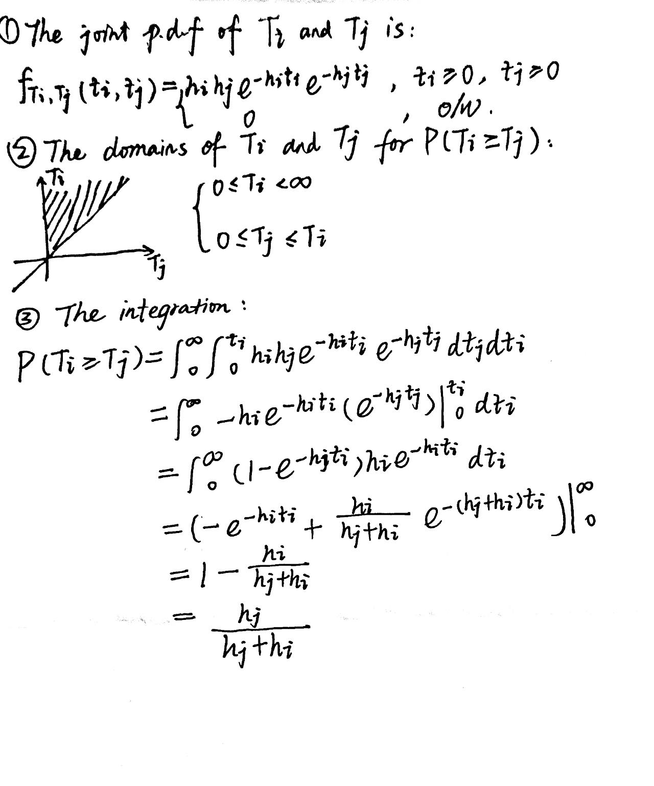

```{r setup, include=FALSE}
knitr::opts_chunk$set(echo = FALSE, message = FALSE, warning = FALSE)
library(tidyverse)
library(knitr)
library(kableExtra)
library(survival)
library(flexsurv)
library(survminer)
library(survMisc)
library(MASS)
```


# Problem 1

**Key information of the background:**

1:1 ratio, Two Sample; 
20 months for the median survival time in the standard of care;
The expected median survival time in the new treatment arm is 28 months;
The enrollment period is 18 months;
The minimum follow-up time for each subject is 24 months.

## How many events will be needed to reach 90% power at the 1-sided significant level of 0.025?

**To achieve 90% power at the 1-sided significant level of 0.025 to detect a 40% increase in median survival time from 20 months in the standard of care to 28 months.**


1. Assuming exponential distribution

2. $\lambda = \frac{20}{28} =\frac{5}{7}$

3. $$d =4 \frac{(z_{1-\alpha}-z_{\beta})^2}{(log \lambda)^2} = 
4 \frac{(1.96+1.28)^2}{(log 0.71)^2} =371$$

So, 371 events are needed to reach 90% power at the 1-sided significant level of 0.025.

## How many subjects should be planned?

4. Hazard function :
$$h = \frac{-log(0.5)}{28} = 0.0248$$

5. Expected event rate:

$$\tau = 24, \tau_{a} = 18$$

$$Pr = 1- e^{-h \tau}(1-e^{-h\tau_a})/h\tau_a \\ = 1-e^{-0.0248*24}(1-e^{-0.0248*18})/(0.0248*18)  \\ = 0.555$$

6. Subjects enrolled:

$$N = \frac{371}{0.555} = 669$$


So, 669 subjects should be planned.


## What is the number of subjects if more investigate sites are available and the enrollment period is shortened to 12 months?


When enrollment period is shortened to 12 months, the $\tau = 12$.


$$Pr = 1- e^{-h \tau}(1-e^{-h\tau_a})/h\tau_a \\ = 1-e^{-0.0248*24}(1-e^{-0.0248*12})/(0.0248*12)  \\ = 0.523$$

Subjects enrolled:

$$N = \frac{371}{0.523} = 710$$


So, 710 subjects should be planned.


## What do you think of the power loss if the hazard ratio is 1 during the first 4 months of treatment? What strategies would you like to recommend to the study team?

1. Assuming a piecewise exponential distribution for the hazard function is strongly suggested.

Suggestions:

2. **Increase the sample size: **The study team could consider increasing the sample size to ensure that the study has sufficient power to detect a difference between the two treatment arms. A larger sample size would also increase the precision of the estimated treatment effect.

3. **Extend the follow-up period: **Since the minimum follow-up time for each subject is 24 months, the study team could consider extending the follow-up period to capture more events and improve the accuracy of the estimated survival curves.

4. **Adjust the randomization ratio: **The study team could consider adjusting the randomization ratio to increase the number of subjects in the new treatment arm. This would increase the power of the study to detect a difference between the two treatment arms.

## Please add your own assumption on the rates of loss of follow-up and re-answer the questions above.

**If the rate of loss of follow-up is 20%**

Total events:

371/(1-20%) = 464

Planned subjects:

669/(1-20%) = 837

Planned subjects when the enrollment period is shortened to 12 months:

710/(1-20%) = 888


# Problem 2

A smaller sample size may result in lower statistical power to detect a difference between the two treatment arms, while a shorter follow-up period may limit the ability to assess long-term outcomes.


# Problem 3



